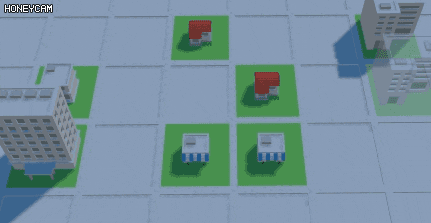

# triplebuilder
triple builder is 3-match puzzle game inspired by tripletown.

# requirement
- node.js (https://nodejs.org/ko/)

# how to run
1. clone repository
2. open terminal and go to 'triplebuilder_app' directory.
3. type <code>npm install</code>
4. run <code>startServer.bat</code>
5. open browser and connect <code>http://localhost:8080</code>

# screenshots

